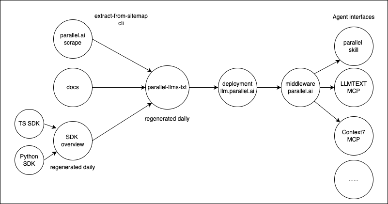

# Parallel llms.txt

This repo contains an entire context of all public Parallel assets, making our content equally as accessible to humans as to machines. It also serves as a template to serve your own agent-friendly website.

# Tools to reduce hallucination using Parallel Context

- [llms.txt MCP](https://llmtext.com/check/parallel.ai)
- [Context7 MCP](https://context7.com/parallel-web/parallel-llms-txt)
- [DeepWiki MCP](https://deepwiki.com/parallel-web/parallel-llms-txt)
- [UITHUB](https://uithub.com/parallel-web/parallel-llms-txt)
- [Git MCP](https://gitmcp.io/parallel-web/parallel-llms-txt)

# How it works

This repo is extracted using the [extract-from-sitemap](https://github.com/janwilmake/llmtext-mcp/tree/main/extract-from-sitemap) CLI which is powered by the [Parallel Extract API](https://docs.parallel.ai/api-reference/search-and-extract-api-beta/extract). This creates a larger `llms.txt` accompanied with linked markdown documents, which is then deployed to https://parallel.ai/llms.txt with docs + sdks + blogs. See [llmtext.json](llmtext.json) for the source configuration.

# Deployment

This repo is deployed as worker with static assets. Putting your websites context in a separate public repo is recommended because it has several benefits:

- By making it separate you can make it open source such that it can be used by various third-party context tools like DeepWiki, gitmcp, and uithub. It also can be explored directly from GitHub, which can be useful for manual context collection.
- By making it separate, you can make it open source without exposing the git history, and it won't interfere with the repo where you implement your main website.

For discovery on your apex domain, you can use a rewriter middleware to rewrite agent requests to your subdomain. For example for next.js, you can use [next-agent-rewriter](https://github.com/janwilmake/llmtext-mcp/tree/main/next-agent-rewriter).

# CI/CD

Source content changes, so to make this work for your website, you need to automate updating the extracted llmtext repo too.

To re-extract periodically, the ['build-and-reset' GitHub action](.github/workflows/build-and-reset.yml) is used. The current setup re-extracts every 6 hours, and resets github history, such that people won't be able to access old content from here. To deploy the final result each time it changes, we use the [Cloudflare Git Integration](https://developers.cloudflare.com/workers/ci-cd/builds/git-integration/).
