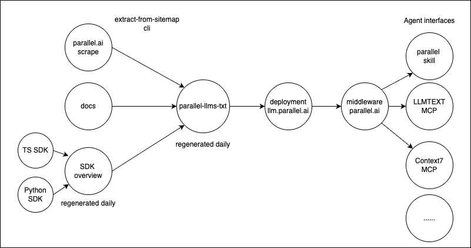

# Parallel llms.txt

This repo mirrors public Parallel content for humans and agents. It is a generated snapshot, not a guarantee of current API guidance. The checked-in corpus was last rebuilt on May 19, 2026; refresh automation stopped publishing and needs the activation steps below.

For new integrations, start with the current [documentation index](https://docs.parallel.ai/llms.txt), [Search quickstart](https://docs.parallel.ai/search/search-quickstart), [Extract quickstart](https://docs.parallel.ai/extract/extract-quickstart), and [OpenAPI schema](https://docs.parallel.ai/public-openapi.json). Verified September 10, 2026: Search uses `/v1/search`, requires `search_queries`, and accepts `max_results` and `excerpt_settings` under `advanced_settings`. Extract uses `/v1/extract`, with `full_content` and `excerpt_settings` under `advanced_settings`. Current SDKs expose `client.search` and `client.extract`.

Older Search/Extract examples in this snapshot may describe the legacy APIs. Use the [Search migration guide](https://docs.parallel.ai/search/search-migration-guide) and [Extract migration guide](https://docs.parallel.ai/extract/extract-migration-guide) for those examples. This distinction applies to Search and Extract; other APIs can legitimately use beta endpoints. Historical articles should retain their source context.

# Tools to reduce hallucination using Parallel Context

- [llms.txt MCP](https://llmtext.com/check/parallel.ai)
- [Context7 MCP](https://context7.com/parallel-web/parallel-llms-txt)
- [DeepWiki MCP](https://deepwiki.com/parallel-web/parallel-llms-txt)
- [UITHUB](https://uithub.com/parallel-web/parallel-llms-txt)
- [Git MCP](https://gitmcp.io/parallel-web/parallel-llms-txt)

# How it works

This repo is extracted using the [extract-from-sitemap](https://github.com/janwilmake/llmtext-mcp/tree/main/extract-from-sitemap) package which is powered by the [Parallel Extract API](https://docs.parallel.ai/extract/extract-quickstart). This creates a larger `llms.txt` accompanied with linked markdown documents, which the checked-in Worker configuration serves at https://llm.parallel.ai/llms.txt with docs + SDKs + blogs. The apex https://parallel.ai/llms.txt has a separate publishing source. See [llmtext.json](llmtext.json) for the source configuration.

# Deployment

This repo is deployed as worker with static assets. Putting your websites context in a separate public repo is recommended because it has several benefits:

- By making it separate you can make it open source such that it can be used by various third-party context tools like DeepWiki, gitmcp, and uithub. It also can be explored directly from GitHub, which can be useful for manual context collection.
- Keeping generated content here keeps its refresh history separate from the application repository.

For discovery on your apex domain, you can use a rewriter middleware to rewrite agent requests to your subdomain. For example for next.js, you can use [next-agent-rewriter](https://github.com/janwilmake/llmtext-mcp/tree/main/next-agent-rewriter).

# CI/CD

Source content changes, so to make this work for your website, you need to automate updating the extracted llmtext repo too.

The [refresh workflow](.github/workflows/build-and-reset.yml) runs every six hours or on manual dispatch from main. It fetches the configured sources, validates a fresh snapshot, commits changed documents to main using the built-in `GITHUB_TOKEN`, and deploys to Cloudflare in the same job. There are no content PRs or separate publishing credentials. Unchanged output creates no commit, but still deploys so the next successful run can recover an earlier deployment failure.

Validation rejects reported extraction errors, empty sources/content, missing configured SDK pages, missing output, and paths outside `public/`. A fresh tree replaces the old one only after validation and staging succeed. This removes obsolete generated pages and preserves the maintained `_redirects` routing file. The publication script commits only Markdown pages and `llms.txt`, preserves Git history, and rejects a push if main advanced during the build. A rejected push stops deployment; the next run starts from the new main.

The extractor still uses legacy Extract internally. These checks do not detect pages silently omitted by an upstream index or establish that every source is factually current.

## Administrator setup and first run

1. Remove the **required pull request/review rule for this repository only**. Main currently inherits it from organization ruleset `16610489`, so an organization administrator must adjust that rule's scope. Keep **branch deletion and force pushes blocked**. If those restrictions share the same ruleset, separate them before excluding this repo from required review. A repository-level rule cannot override an inherited organization rule. This deliberately allows trusted writers, including the workflow, to push normally without mandatory PR approval.
2. Allow the workflow's declared **Contents: write** permission for `GITHUB_TOKEN` and confirm repository secrets `PARALLEL_API_KEY` and `CLOUDFLARE_API_TOKEN` are configured. No GitHub App, private key, auto-merge setting, or permission to create PRs is needed. If App credentials were provisioned for an earlier proposal, remove them; this version does not use them.
3. Merge this PR, then re-enable the existing `build-and-reset.yml` workflow, currently disabled for inactivity. Do not run the old workflow before merge. Dispatch the repaired workflow from main and verify the generated commit and https://llm.parallel.ai/llms.txt deployment. Merging this PR alone does not trigger a crawl or deployment.
4. Update the snapshot note above after that verified refresh. There is no routine review queue. Check failed or disabled runs so problems do not leave the mirror stale silently. Maintained Worker/configuration changes deploy with the next successful refresh or a manual dispatch from main.

The apex https://parallel.ai/llms.txt has a separate publishing source. This workflow does not update it or request downstream indexing.
