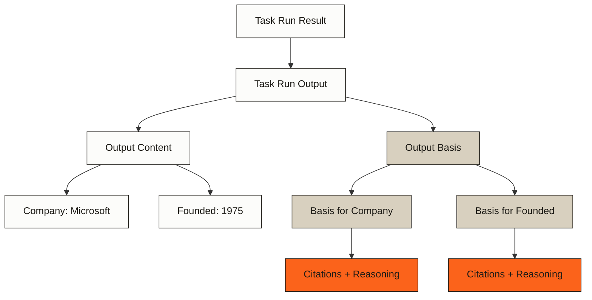

> ## Documentation Index
> Fetch the complete documentation index at: https://docs.parallel.ai/llms.txt
> Use this file to discover all available pages before exploring further.

# Research Basis

> Understand how to access citations, reasoning, and confidence levels for your Task Run outputs

When you execute a task using the Task API, the response includes both the generated output and its corresponding research basis—a structured explanation detailing the reasoning and evidence behind each result. This transparency enables you to understand how the system arrived at its conclusions and to assess the reliability of the output.

## Terminology

To avoid confusion, this document uses the following terminology:

* **Research Basis**: The overall feature that provides transparency into how Task API results are generated
* **Basis**: The `basis` field in the API response, which contains an array of field-specific evidence
* **FieldBasis**: The specific object type that contains citations, reasoning, and confidence for individual output fields

## Task Run Result

Every Task Run Result object contains the following fields:

| Field    | Type                         | Description                                                                                |
| -------- | ---------------------------- | ------------------------------------------------------------------------------------------ |
| `run`    | object                       | Task Run object with status and id, detailed above.                                        |
| `output` | TaskRunOutput object or null | Output from the task conforming to the output schema. Present iff run.status == completed. |

A TaskRunOutput object can be one of two types:

* TaskRunTextOutput
* TaskRunJsonOutput

Both have the following fields:

| Field     | Type               | Description                                                                                    |
| --------- | ------------------ | ---------------------------------------------------------------------------------------------- |
| `content` | string             | JSON or plain text according to the output schema.                                             |
| `basis`   | array\[FieldBasis] | Array of FieldBasis objects, one for each top-level output field. See FieldBasis object below. |
| `type`    | string             | Always `text`                                                                                  |

## Research Basis Structure

The `basis` field contains an array of FieldBasis objects that correspond to each top-level field in your output. This allows you to trace exactly which sources on the web contributed to each specific piece of information in your result.



## The FieldBasis object

Each FieldBasis object has these components:

| Field        | Type             | Description                                             |
| ------------ | ---------------- | ------------------------------------------------------- |
| `field`      | string           | Name of the corresponding output field                  |
| `citations`  | array\[Citation] | List of web sources supporting the output field         |
| `reasoning`  | string           | Explanation of how the system processed the information |
| `confidence` | string or null   | Reliability rating for each output field                |

### Citations

Citations provide the exact URLs where information was found. Each citation includes excerpts from the source that contributed to the output:

| Field      | Type                   | Description                   |
| ---------- | ---------------------- | ----------------------------- |
| `url`      | string                 | The source URL                |
| `excerpts` | array\[string] or null | Relevant text from the source |

Having multiple citations for an output field often indicates stronger evidence, as the information was verified across multiple sources.

### Reasoning

The reasoning field explains how the system evaluated, compared, and synthesized information from different sources. This is particularly valuable when:

* Information from different sources needed to be reconciled
* Calculations or conversions were performed
* The system needed to make judgments about conflicting data

### Confidence Levels

All processors include a confidence rating for each output field:

* **High**: Strong evidence from multiple authoritative sources with consistent information
* **Medium**: Adequate evidence but with some inconsistencies or from less authoritative sources
* **Low**: Limited or conflicting evidence, or information from less reliable sources

### Per-element Basis (beta)

By default, `basis` entries are emitted only for the top-level fields in your output schema.
If a top-level field is an array and you need citations for each element, opt in to the **field-basis** beta header:

```text  theme={"system"}
parallel-beta: field-basis-2025-11-25
```

When this header is present on task creation requests:

* The Task API still returns top-level FieldBasis objects.
* Each element of a Top-level field with an array value gains an additional FieldBasis and it's own `field` which follows the pydash-style dot notation (e.g., `key_executives.0`, `key_executives.1`).
* No other schema changes are required; you simply read the expanded `basis` array.

## Examples

### Output with Research Basis

Here's an example of a complete Task Run output that includes research basis information:

```json  theme={"system"}
{
  "content": "{\"company\":\"Microsoft\",\"founded\":\"1975\",\"headquarters\":\"Redmond, Washington, USA\"}",
  "basis": [
    {
      "field": "company",
      "citations": [
        {
          "url": "https://www.microsoft.com/en-us/about",
          "excerpts": ["Microsoft Corporation is an American multinational technology corporation headquartered in Redmond, Washington."]
        }
      ],
      "reasoning": "The company name is clearly identified on the official corporate website.",
      "confidence": "high"
    },
    {
      "field": "founded",
      "citations": [
        {
          "url": "https://www.microsoft.com/en-us/about/company",
          "excerpts": ["Founded in 1975, Microsoft (Nasdaq "MSFT") enables digital transformation for the era of an intelligent cloud and an intelligent edge."]
        },
        {
          "url": "https://en.wikipedia.org/wiki/Microsoft",
          "excerpts": ["Microsoft Corporation was founded by Bill Gates and Paul Allen on April 4, 1975, to develop and sell BASIC interpreters for the Altair 8800."]
        }
      ],
      "reasoning": "Multiple authoritative sources consistently state 1975 as the founding year. The official company website and Wikipedia both confirm this date, with Wikipedia providing the specific day (April 4).",
      "confidence": "high"
    },
    {
      "field": "headquarters",
      "citations": [
        {
          "url": "https://www.microsoft.com/en-us/about/company",
          "excerpts": ["Headquartered in Redmond, Washington, Microsoft has offices in over 100 countries."]
        }
      ],
      "reasoning": "The official company website explicitly states the headquarters location as Redmond, Washington, USA.",
      "confidence": "high"
    }
  ],
  "type": "json"
}
```

### High vs. Low Confidence Outputs

<Tabs>
  <Tab title="High Confidence">
    ```json  theme={"system"}
    {
      "field": "revenue",
      "citations": [
        {
          "url": "https://www.microsoft.com/en-us/Investor/earnings/FY-2023-Q4/press-release-webcast",
          "excerpts": ["Microsoft reported fiscal year 2023 revenue of $211.9 billion, an increase of 7% compared to the previous fiscal year."]
        },
        {
          "url": "https://www.sec.gov/Archives/edgar/data/789019/000095017023014837/msft-20230630.htm",
          "excerpts": ["Revenue was $211.9 billion for fiscal year 2023, up 7% compared to $198.3 billion for fiscal year 2022."]
        }
      ],
      "reasoning": "The revenue figure is consistent across both the company's investor relations page and their official SEC filing. Both sources explicitly state the fiscal year 2023 revenue as $211.9 billion, representing a 7% increase over the previous year.",
      "confidence": "high"
    }
    ```
  </Tab>

  <Tab title="Low Confidence">
    ```json  theme={"system"}
    {
      "field": "crm_system",
      "citations": [
        {
          "url": "https://www.linkedin.com/jobs/view/sales-representative-microsoft-dynamics-365-at-contoso-inc-3584271",
          "excerpts": ["Looking for sales professionals with experience in Microsoft Dynamics 365 CRM to join our growing team."]
        }
      ],
      "reasoning": "There is limited direct evidence about which CRM system the company uses internally. The job posting suggests they work with Microsoft Dynamics 365, but it's not explicitly stated whether this is their primary internal CRM or simply a product they sell/support. No official company documentation confirming their internal CRM system was found.",
      "confidence": "low"
    }
    ```
  </Tab>
</Tabs>

### Per-Element Basis

When working with arrays in your output, the research basis can provide granular citations for individual elements. Here's an example showing how basis information is provided for both the parent array and individual elements:

```json  theme={"system"}
{
  "content": "{\"company\":\"OpenAI\",\"key_executives\":[{\"name\":\"Sam Altman\",\"title\":\"CEO\"},{\"name\":\"Greg Brockman\",\"title\":\"President\"}]}",
  "basis": [
    {
      "field": "company",
      "citations": [
        {
          "url": "https://openai.com/about",
          "excerpts": ["OpenAI is headquartered in San Francisco, California."]
        }
      ],
      "reasoning": "The company name is taken from the official about page.",
      "confidence": "high"
    },
    {
      "field": "key_executives",
      "citations": [
        {
          "url": "https://openai.com/leadership",
          "excerpts": ["Key executives include Sam Altman and Greg Brockman."]
        }
      ],
      "reasoning": "The leadership page lists each executive explicitly.",
      "confidence": "high"
    },
    {
      "field": "key_executives.0",
      "citations": [
        {
          "url": "https://openai.com/leadership",
          "excerpts": ["Sam Altman serves as the CEO of OpenAI."]
        }
      ],
      "reasoning": "Same source, filtered down to the first list element.",
      "confidence": "high"
    },
    {
      "field": "key_executives.1",
      "citations": [
        {
          "url": "https://openai.com/leadership",
          "excerpts": ["Greg Brockman serves as President."]
        }
      ],
      "reasoning": "Same source, filtered down to the second list element.",
      "confidence": "high"
    }
  ],
  "type": "json"
}
```
